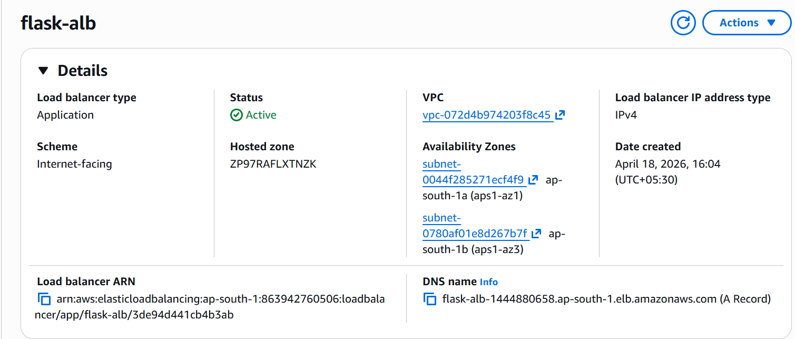
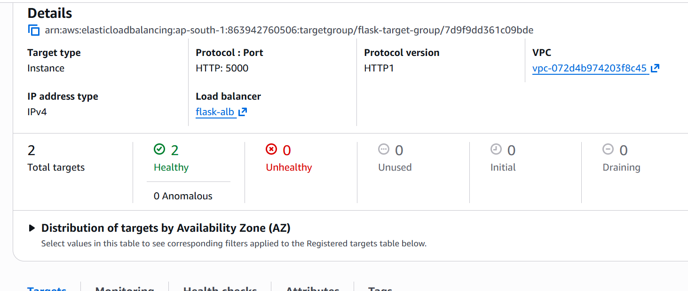
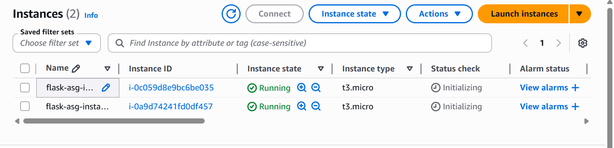
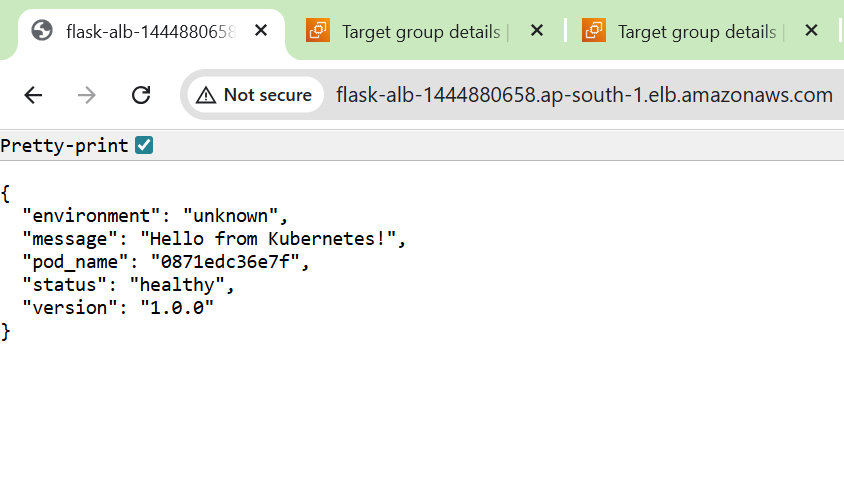

🚀 AWS DevOps Journey

Not tutorials. Real infrastructure. Real automation.

Built a production-style DevOps system using Terraform, AWS, Docker, and CI/CD pipelines.

💡 Real-world debugging experience:

Resolved a 504 Gateway Timeout caused by security group misconfiguration and port mismatch between ALB and application.

This project demonstrates real-world infrastructure design, automation, and debugging experience.

🌍 Live Project Flask App on AWS

A containerized Flask application deployed on AWS using Infrastructure as Code and CI/CD.

🏗 Architecture

User → ALB → Target Group → Auto Scaling Group → EC2 → Docker → Flask App
Logs → CloudWatch (centralized logging & monitoring)

## 📸 Proof (Real Execution)
### 🔍 Terraform Plan (PR Comment)


### ⚙️ CI/CD Pipeline (GitHub Actions)


### 🌍 EC2 Running on AWS


### 🔐 OIDC Authentication Setup


## ⚙️ Tech Stack

- **Infrastructure:** Terraform, AWS  
- **Containers:** Docker  
- **CI/CD:** GitHub Actions + OIDC  
- **Orchestration:** Kubernetes (Minikube)

## 🔍 Observability (CloudWatch)

Implemented CloudWatch Agent to collect logs directly from Docker containers:

* Collected logs from `/var/lib/docker/containers/*/*.log`
* Centralized logs in CloudWatch (`docker-logs` log group)
* Used logs to verify ALB health checks and application behavior
* Enabled real-time debugging without SSH access

This simulates real-world production monitoring systems.


🔥 What makes this production-grade

- Infrastructure as Code using Terraform
- Remote state with S3 + DynamoDB locking
- CI/CD pipeline with PR-based plan and controlled apply
- Secure authentication using AWS OIDC (no static credentials)
- Auto Scaling Group for dynamic scaling
- Application Load Balancer for traffic distribution
- Health checks for fault tolerance

🧱 Infrastructure Built
🌐 Networking
Custom VPC (10.0.0.0/16)
Public + private subnets (multi-AZ)
Internet Gateway + NAT Gateway
Route tables + associations
Security groups (least privilege)

💻 Compute
EC2 provisioned via Terraform
Docker installed via user_data
Flask app deployed automatically
No SSH, no manual steps

📦 State Management
S3 backend (shashi-terraform-state-2026)
DynamoDB locking (terraform-state-locks)
Remote state sharing across modules

🔄 CI/CD Pipeline

File: .github/workflows/terraform.yml
Trigger: PR & push to main (path filtered)
Plan job: fmt → init → validate → plan → PR comment
Apply job: runs only after merge
Auth: AWS OIDC (temporary credentials, auto-expire)

☸️ Kubernetes (Learning Extension)

To extend this project, the same Flask application was deployed on Kubernetes (Minikube):

- 3 replicas (RollingUpdate)
- ConfigMaps & Secrets
- Liveness & Readiness probes
- Resource limits
- NodePort Service
- Canary deployment tested

This demonstrates understanding of container orchestration beyond EC2-based deployments.

Docker image: shashikarandev/flask-webapp:v1

## Project Overview
Deployed a highly available Flask application using AWS ALB, Auto Scaling Group, and Terraform.

## Architecture
User → ALB → Target Group → ASG → EC2 → Docker → Flask

## Features
- Load balancing using ALB
- Auto scaling using ASG
- Dockerized application deployment
- Health checks and fault tolerance

## Screenshots
### Load Balancer Working


### Target Group Healthy


### EC2 Instances (ASG)


### Architecture


## Key Learnings
- Debugged 504 Gateway Timeout
- Fixed security group misconfiguration
- Resolved port mismatch (80 vs 5000)
- Implemented real-world DevOps architecture

## 📚 Terraform Levels Completed

| Level | Description |
|------|------------|
| 1 | Basics: providers, resources, state |
| 2 | Variables, outputs |
| 3 | Modules, remote state |
| 4 | VPC, subnets, networking |
| 5 | NAT, EKS IAM roles |
| 6 | EC2 + user_data + live deployment |
| 7 | CI/CD pipeline + OIDC |


## 📁 Repository Structure

```
aws-devops-journey/
├── .github/workflows/terraform.yml
├── terraform-journey/
│   ├── 01-basics/
│   ├── 02-modules/
│   ├── 03-remote-state/
│   ├── 04-vpc/
│   ├── 05-eks/
│   └── 06-ec2-flask/
├── kubernetes/
│   ├── flask-webapp/
│   └── eks-flask/
├── assets/
└── README.md
```
## 🛠 Tools & Technologies

- **Infrastructure:** Terraform, AWS  
- **Containers:** Docker, Kubernetes  
- **CI/CD:** GitHub Actions + OIDC  
- **Security:** IAM, MFA, least privilege  
- **OS:** Linux, Bash  

## 👨‍💻 Author
G. Shashi Karan
Hyderabad, India  

🔗 GitHub: https://github.com/ShashiKaran-git  
🔗 LinkedIn: https://www.linkedin.com/in/shashikaran  
