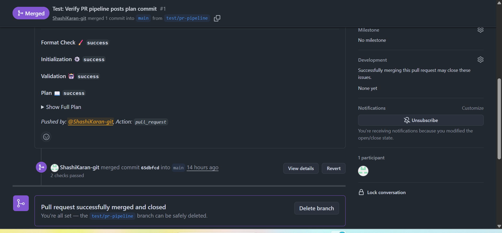
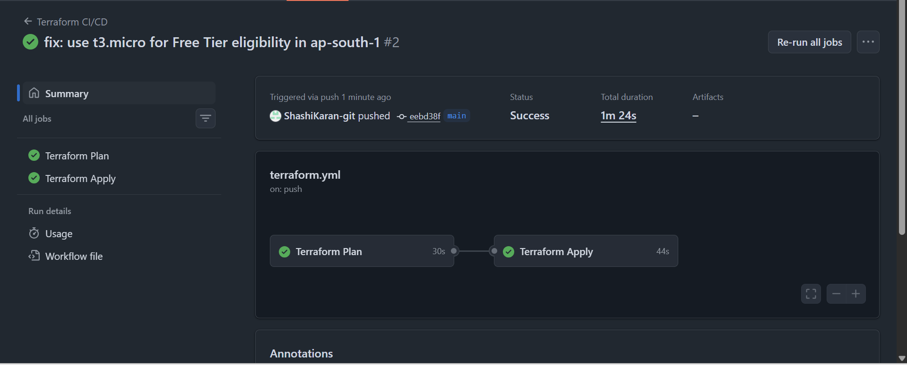
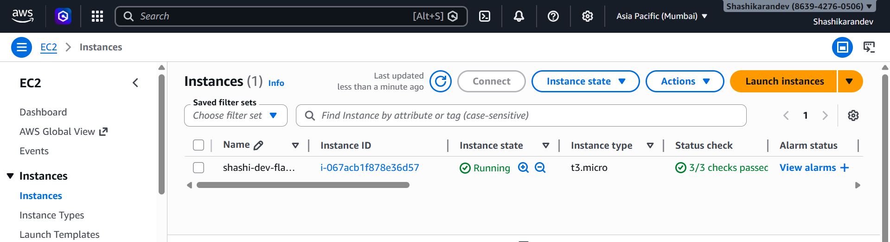
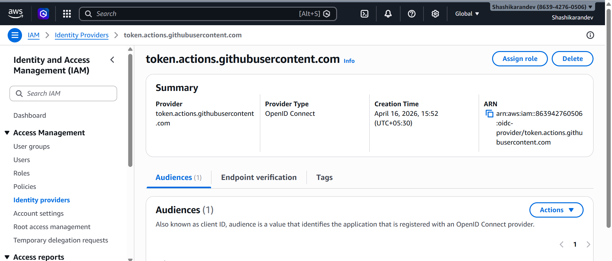

🚀 AWS DevOps Journey
Production grade DevOps system built from scratch
Not tutorials. Real infrastructure. Real automation.

🌍 Live Project Flask App on AWS
A containerized Flask application deployed on AWS using Infrastructure as Code and CI/CD.
🔗 Architecture (High Level)
User → GitHub → GitHub Actions → Terraform → AWS EC2 → Flask App

## 📸 Proof (Real Execution)
### 🔍 Terraform Plan (PR Comment)


### ⚙️ CI/CD Pipeline (GitHub Actions)


### 🌍 EC2 Running on AWS


### 🔐 OIDC Authentication Setup


⚙️ Stack
Docker → Docker Hub → Terraform → GitHub Actions → AWS EC2

🔥 What makes this production-grade
No manual deployments - everything via Git workflow
CI/CD pipeline with PR-based plan & controlled apply
OIDC authentication - no AWS credentials stored
Remote state in S3 + DynamoDB locking
Dynamic AMI lookup (no hardcoding)

🧱 Infrastructure Built
🌐 Networking
Custom VPC (10.0.0.0/16)
Public + private subnets (multi-AZ)
Internet Gateway + NAT Gateway
Route tables + associations
Security groups (least privilege)

💻 Compute
EC2 provisioned via Terraform
Docker installed via user_data
Flask app deployed automatically
No SSH, no manual steps

📦 State Management
S3 backend (shashi-terraform-state-2026)
DynamoDB locking (terraform-state-locks)
Remote state sharing across modules

🔄 CI/CD Pipeline

File: .github/workflows/terraform.yml
Trigger: PR & push to main (path filtered)
Plan job: fmt → init → validate → plan → PR comment
Apply job: runs only after merge
Auth: AWS OIDC (temporary credentials, auto-expire)

☸️ Kubernetes
Flask app deployed on Kubernetes (minikube):
3 replicas (RollingUpdate)
ConfigMaps + Secrets
Liveness & Readiness probes
Resource limits
NodePort Service
Canary deployment tested

Docker image: shashikarandev/flask-webapp:v1

## 📚 Terraform Levels Completed

| Level | Description |
|------|------------|
| 1 | Basics: providers, resources, state |
| 2 | Variables, outputs |
| 3 | Modules, remote state |
| 4 | VPC, subnets, networking |
| 5 | NAT, EKS IAM roles |
| 6 | EC2 + user_data + live deployment |
| 7 | CI/CD pipeline + OIDC |


## 📁 Repository Structure

```bash
aws-devops-journey/
├── .github/workflows/terraform.yml
├── terraform-journey/
│   ├── 01-basics/
│   ├── 02-modules/
│   ├── 03-remote-state/
│   ├── 04-vpc/
│   ├── 05-eks/
│   └── 06-ec2-flask/
├── kubernetes/
│   ├── flask-webapp/
│   └── eks-flask/
├── assets/
└── README.md


---

## 🔥 Tools Section (FIXED)
## 🛠 Tools & Technologies

- **Infrastructure:** Terraform, AWS  
- **Containers:** Docker, Kubernetes  
- **CI/CD:** GitHub Actions + OIDC  
- **Security:** IAM, MFA, least privilege  
- **OS:** Linux, Bash  

## 👨‍💻 Author

**G. Shashi Karan**  
Hyderabad, India  

🔗 GitHub: https://github.com/ShashiKaran-git  
🔗 LinkedIn: https://www.linkedin.com/in/shashikaran  
